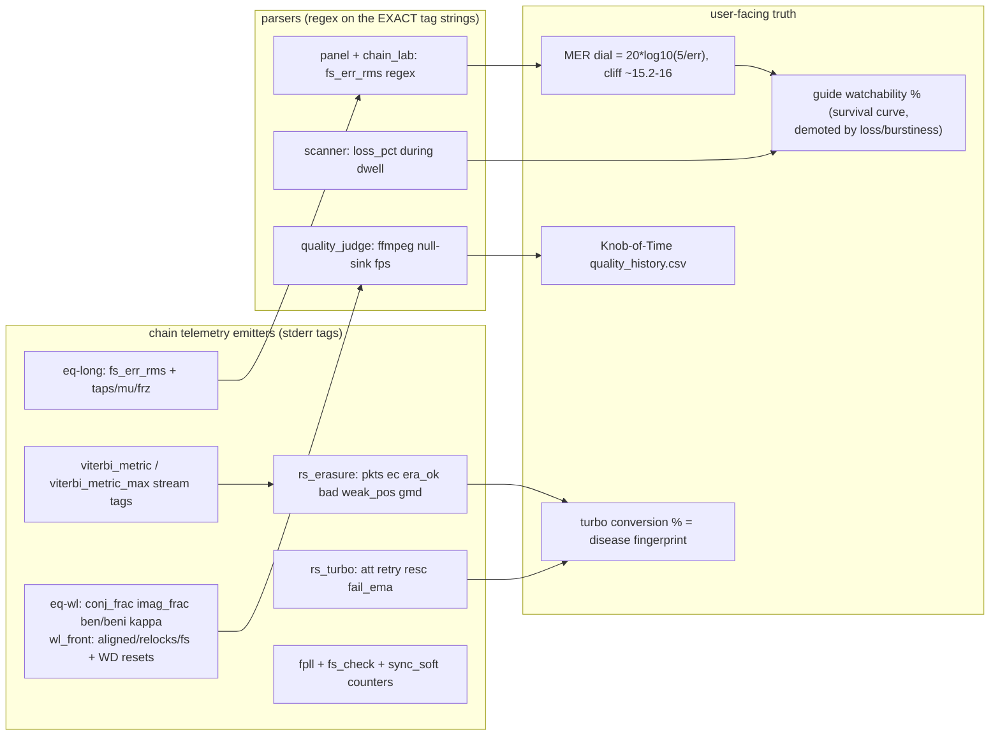
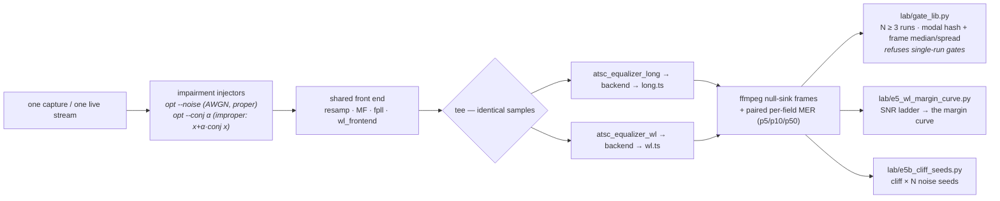

# STVT — System Architecture

Over-the-air **ATSC 8-VSB** television, decoded entirely in software on any SoapySDR radio. Read the diagram top-to-bottom as the signal's journey: RF photons → SDR → the GNU Radio decode chain → an MPEG-TS stream → players — with a telemetry-and-learning layer that reads the equalizer's own error signal to tune any antenna.

**Solid arrows** = signal / data flow · **dashed** = control / telemetry / file I/O · **thick** = front-end spawns.

> A rendered, zoomable version also lives in the [stvt-how-it-works](https://felbs.github.io/stvt-how-it-works/) explainer.

```mermaid
flowchart TB
%% ============================================================================
%%  STVT — Software TV Tuner : System Architecture
%%  Over-the-air ATSC 8-VSB reception on any SoapySDR radio.
%%
%%  Read top-to-bottom as the signal's journey:
%%    RF photons -> SDR -> GNU Radio DSP decode chain -> MPEG-TS (live.ts)
%%    -> player / record / stream.  Two front-ends drive it (CLI + web panel);
%%    a telemetry + learning layer reads the decoder's own equalizer error to
%%    tune any antenna.  Boxes are modules/blocks; solid arrows = data/signal
%%    flow, dashed arrows = control / telemetry / file I/O.
%%
%%  This file is a living reference: keep it in sync when the chain changes.
%% ============================================================================

    %% ---------------------------------------------------------------- FRONT ENDS
    subgraph UI["User front-ends"]
        direction LR
        CLI["tv_tuner.py<br/><i>CLI orchestrator</i><br/>scan · guide · tune · play<br/>record · stream · captions<br/>interactive channel surf"]
        PANEL["tv_tuna_panel.py<br/><i>web UI · http.server :8642</i><br/>Guide tab · NERD tab · Signal Finder<br/>class H / Panel(ThreadingHTTPServer)"]
        BROWSER(["Browser<br/>localhost:8642"])
        BROWSER --- PANEL
    end

    %% ---------------------------------------------------------------- SDR LAYER
    subgraph SDR["SDR hardware + access layer"]
        direction LR
        ANT>"Antenna<br/>TV yagi · discone · rabbit-ears"]
        RADIO["SDR device<br/>SDRplay RSPdx/RSP1A · PlutoSDR<br/>RTL-SDR · HackRF · Airspy · BladeRF"]
        SOAPY["SoapySDR<br/>vendor driver + SoapyRemote"]
        COMPAT["sdr_compat.py<br/>resolve_soapy_args() · gain/antenna xlate<br/><i>issue #2: any radio, not just sdrplay</i>"]
        CONFIG["config.py<br/>antenna/gain recipes · rates · geo · ports"]
        PROBE["probe_sdr.py<br/>enumerate · antennas · rates diagnostic"]
        ANT --> RADIO --> SOAPY
        COMPAT -.-> SOAPY
        CONFIG -.-> COMPAT
        PROBE -.-> SOAPY
    end

    %% ---------------------------------------------------------------- DSP CHAIN
    subgraph CHAIN["ATSC decode chain — tv_live.py  (GNU Radio top_block · gr-atscplus OOT module)"]
        direction TB
        SRC["soapy.source<br/>8 MS/s · fc32 · retry-on-busy<br/>persistent runtime set_frequency/set_antenna<br/><i>self-heal on a wedged API: restart the vendor service<br/>(Windows: SDRplayAPIService · Linux: systemctl sdrplay)</i>"]
        SCALE["multiply_const_cc x32768<br/><i>match offline int16 scaling</i>"]
        NB{{"atsc_noise_blanker<br/><i>opt STVT_NB</i>"}}
        RESAMP["rational_resampler 25/32<br/>8M -> 6.25 MS/s"]
        NOTCH{{"atsc_adaptive_notch<br/><i>opt STVT_NOTCH</i>"}}
        SMOOTH{{"atsc_spectral_smoother<br/><i>opt STVT_SPECTRAL</i>"}}
        RXF["atsc_rx_filter<br/>RRC matched filter -> ~16.14 MS/s<br/><i>or fused resampler+MF STVT_RXF_FUSED</i>"]
        FPLL["atsc_fpll_tight<br/>carrier recovery · alpha=0.001 · AFC tau"]
        DCR["dc_blocker_ff"]
        AGC["agc_ff"]
        SYNC["atsc_sync_soft<br/>symbol timing recovery"]
        FSCHK["atsc_fs_checker_inst<br/>field-sync (PN511/PN63) detect + validate"]
        EQ["atsc_equalizer_long<br/>256-tap LMS + DFE · <b>fs_err_rms telemetry = MER</b><br/><i>warm start from per-install tap cache</i><br/><i>cold-start data recycling STVT_EQ_RECYCLE</i>"]
        WLF["atsc_wl_frontend<br/><i>STVT_EQ=wl only — fuses timing+framing and carries<br/>the imaginary companion; acquisition watchdog</i>"]
        EQWL["atsc_equalizer_wl<br/><i>widely-linear: filters x AND x* (folded to two real dots)<br/>v3 adaptive imag-plane shrinkage · conj_frac telemetry<br/>warm start from its OWN cache ('TAPW', path + .wl)</i>"]
        VIT["atsc_viterbi_soft / dtv.atsc_viterbi_decoder<br/>12-way trellis decode<br/><i>port2 = SOVA reliability (STVT_SOVA)</i>"]
        DEINT["atsc_deinterleaver<br/>convolutional de-interleave"]
        RS["atsc_rs_decoder_erasure / stock<br/>Reed-Solomon (207,187) FEC<br/><i>TURBO 2b trellis-pin retry STVT_TURBO</i>"]
        DERAND["atsc_derandomizer<br/>energy de-whiten"]
        DEPAD["atsc_depad<br/>-> 188-byte MPEG-TS packets"]
        TEI["TEIScrub<br/>RS-uncorrectable packet -> NULL PID 0x1FFF<br/><i>preserves continuity counters</i>"]
        FSINK["file_sink (unbuffered)<br/>-> live.ts"]

        SRC --> SCALE --> NB --> RESAMP --> NOTCH --> SMOOTH --> RXF
        RXF --> FPLL --> DCR --> AGC --> SYNC --> FSCHK --> EQ
        EQ --> VIT --> DEINT --> RS --> DERAND --> DEPAD --> TEI --> FSINK
        %% opt-in widely-linear path: same backend, different equalizer
        FPLL -. "STVT_EQ=wl<br/>(complex out)" .-> WLF
        WLF -. "real seg + imag companion" .-> EQWL
        EQWL -. "real symbols" .-> VIT
    end

    %% ---------------------------------------------------------------- OUTPUT
    subgraph OUT["Presentation — live.ts consumers"]
        direction LR
        LIVETS[("live.ts<br/>data/tv_live/<br/>rotates at ~20 GB")]
        TAIL["TailWorker (CLI)<br/>tail + 188-byte realign<br/>NULL-packet heartbeat"]
        FFMPEG["ffmpeg<br/>program select · transcode/copy<br/>tee fan-out"]
        WATCH["tv_watch.py<br/><i>panel playback supervisor</i><br/>growth-proved extraction · extractor rebuild on repeat death<br/>resync-storm breaker · 608 flush on every seek/reload<br/><b>reads the dir the chain writes — STVT_LIVE_DIR</b>"]
        PLAYER["Player window<br/>ffplay · mpv · vlc · tv_player.py<br/>(panel: tv_watch.py / harvest_player.py)"]
        REC["MP4 recording<br/>recordings/*.mp4"]
        STREAM["RTMP stream<br/>Twitch/YouTube (flv)"]
        CC["Closed captions<br/>atsc_cc.py (CEA-608) / ccextractor"]

        LIVETS --> TAIL --> FFMPEG
        LIVETS --> WATCH --> FFMPEG
        FFMPEG --> PLAYER
        FFMPEG --> REC
        FFMPEG --> STREAM
        LIVETS -.-> CC
        WATCH -.->|flush| CC
    end

    %% ---------------------------------------------------------------- PSIP/EPG
    subgraph GUIDE["Guide / PSIP-EPG"]
        direction LR
        PSIP["atsc_psip.py<br/>parse TVCT/CVCT + EIT + MGT<br/>virtual channels · now-playing events"]
        EPG["stvt_epg.py<br/>load_epg · scan.json grid"]
        STATIONS["default_stations.py<br/>callsign/network gap-fill"]
        PSIP --> EPG
        STATIONS -.-> EPG
    end

    %% ------------------------------------------------- ADAPTIVE / LEARNING LAYER
    subgraph ADAPT["Universal tuning + telemetry layer  (adaptive-tv/)"]
        direction TB
        CHAINLOG[/"chain log<br/>fs_err_rms · FPLL · RS loss · CIR echoes"/]
        MERMETER["mer_meter.py<br/>live MER dashboard · aim-by-ear tone"]
        TUNEANT["tune_antenna.py<br/>sweep -> classify -> calibrate -> verdict<br/>CLEAN/IMPULSE/BELOW-CLIFF/PHANTOM"]
        MERGAIN["mer_gain_cal.py · gain_sweep.py<br/>gain grid search on MER"]
        CHSCAN["ch_scan.py<br/>per-port carrier sniff"]
        QJUDGE["quality_judge.py<br/>ffmpeg null-decode -> 0-100 score"]
        DEEPTUNE["deep_tune.py — DEEP TUNE doctor<br/>baseline · antenna race · gain grid<br/>disease class · saved recipe"]
        TIMEKNOB["time_knob.py — Knob of Time<br/>per-channel/antenna 24h quality curves"]
        ANTID["antenna_id.py<br/>spectral fingerprint -> identity<br/>RECOGNIZED/MOVED/NEW/CHANGED"]
        PLANNER["scan_planner.py<br/>predictive scan order + dwell budget"]
        SWEEP["sdr_sweep.py<br/>phase-1 pilot/carrier FFT sniff"]
        E7["e7_vote.py — replay-heal<br/>offline re-decode of IQ ring"]

        CHAINLOG -.-> MERMETER
        CHAINLOG -.-> DEEPTUNE
        CHAINLOG -.-> TUNEANT
        CHSCAN --> TUNEANT
        MERGAIN --> TUNEANT
        QJUDGE --> TUNEANT
        DEEPTUNE --> TIMEKNOB
        ANTID -.-> TIMEKNOB
    end

    %% ---------------------------------------------------------------- STATE FILES
    subgraph STATE["Persistent learned state"]
        direction LR
        SCANJSON[("scan.json<br/>locked chans · programs · PSIP · MER")]
        PIDCACHE[("pid_cache.json<br/>warm-tune PID seed")]
        QHIST[("quality_history.csv<br/>Knob-of-Time rows")]
        RECIPES[("channel_recipes.json<br/>winning gain/antenna per chan")]
        FINGER[("antenna_profiles.json<br/>fingerprints · epochs · belief_map")]
        TAPS[("tapcache/<br/>warm-start EQ taps<br/><i>taps_&lt;ant&gt;_rf&lt;N&gt;.bin = long ('TAPC')<br/>+ .wl sibling = widely-linear ('TAPW')</i>")]
        ORACLE[("oracle_score.csv<br/>forecast-accuracy audit")]
    end

    %% ---------------------------------------------------------------- CONTROL PLANE
    RETUNE{{"Persistent-retune protocol<br/>retune.cmd -> ack<br/><i>~10 s channel change, no chain teardown</i>"}}
    DOCTOR["chain_doctor (panel)<br/>psutil watch · ~40 s silent-death detect<br/>auto-retune · heal-rate cap"]
    DVR["stvt_schedule.py<br/><i>DVR controller — &quot;stvt_schedule.py tv&quot; is the headline UI</i><br/>guide -> queue -> multirec · stale/blown jobs expire on read<br/><i>one mux at a time: the daemon SKIPS, never stacks</i>"]

    %% ================================================================ CROSS-EDGES
    %% front-ends -> chain
    CLI ==>|"spawn --rf N"| SRC
    PANEL ==>|"spawn tv_live.py"| SRC
    PANEL -.->|write| RETUNE
    RETUNE -.->|"set_frequency / set_antenna"| SRC
    CLI -.-> CONFIG
    SRC --- SOAPY

    %% chain -> outputs
    FSINK ==> LIVETS
    EQ -.->|stderr| CHAINLOG

    %% front-ends read guide + telemetry
    CLI -.-> PSIP
    PANEL -.-> EPG
    CLI ==>|"per-channel lock test"| SWEEP
    PANEL ==> SWEEP
    SWEEP -.-> SDR
    PANEL -.-> MERMETER
    PANEL -.-> DEEPTUNE
    PANEL -.-> ANTID
    PANEL -.-> E7
    LIVETS -.-> QJUDGE
    LIVETS -.-> PSIP

    %% learning reads/writes
    CLI -.->|write| SCANJSON
    PANEL -.-> SCANJSON
    SCANJSON -.-> EPG
    DEEPTUNE -.-> RECIPES
    TIMEKNOB -.-> QHIST
    ANTID -.-> FINGER
    TIMEKNOB -.-> ORACLE
    PANEL -.-> PIDCACHE
    EQ -.-> TAPS
    RECIPES -.->|consulted on tune| PANEL
    PIDCACHE -.->|warm tune| PANEL

    %% watchdog
    DOCTOR -.->|monitors| SRC
    DOCTOR -.->|re-tune| PANEL

    %% playback contract — the panel's chain and the watcher must agree on the dir
    PANEL -.->|"STVT_LIVE_DIR (pins watcher to this chain)"| WATCH

    %% DVR
    DVR -.->|read| EPG
    DVR ==>|"spawn chain + multirec"| SRC
    DVR --> REC

    %% SDR feeds the chain source
    SOAPY ==> SRC

    %% ---------------------------------------------------------------- STYLING
    classDef ui       fill:#1e3a5f,stroke:#4a90d9,color:#eaf2fb,stroke-width:2px;
    classDef hw       fill:#3d2b1f,stroke:#c98a3a,color:#f7ecde,stroke-width:2px;
    classDef dsp      fill:#14352a,stroke:#3fa87a,color:#e6f6ee,stroke-width:1px;
    classDef opt      fill:#14352a,stroke:#3fa87a,color:#bfe6d4,stroke-width:1px,stroke-dasharray:4 3;
    classDef out      fill:#3a1f3d,stroke:#b45fc0,color:#f6e6f8,stroke-width:2px;
    classDef adaptive fill:#3a331a,stroke:#c9b83a,color:#f7f3de,stroke-width:1px;
    classDef file     fill:#222,stroke:#888,color:#ddd,stroke-width:1px;
    classDef ctrl     fill:#4a1e1e,stroke:#d95a5a,color:#f8e6e6,stroke-width:2px;
    classDef guide    fill:#1f3a3a,stroke:#3fb8b8,color:#e6f7f7,stroke-width:1px;

    class CLI,PANEL,BROWSER ui;
    class ANT,RADIO,SOAPY,COMPAT,CONFIG,PROBE hw;
    class SRC,SCALE,RESAMP,RXF,FPLL,DCR,AGC,SYNC,FSCHK,EQ,WLF,EQWL,VIT,DEINT,RS,DERAND,DEPAD,TEI,FSINK dsp;
    class NB,NOTCH,SMOOTH opt;
    class LIVETS,TAIL,FFMPEG,WATCH,PLAYER,REC,STREAM,CC out;
    class PSIP,EPG,STATIONS guide;
    class MERMETER,TUNEANT,MERGAIN,CHSCAN,QJUDGE,DEEPTUNE,TIMEKNOB,ANTID,PLANNER,SWEEP,E7,CHAINLOG adaptive;
    class SCANJSON,PIDCACHE,QHIST,RECIPES,FINGER,TAPS,ORACLE file;
    class RETUNE,DOCTOR,DVR ctrl;
```

## Telemetry — the dials and the contract behind them

The chain's C++ blocks and tools emit tagged stderr lines; the panel and lab
tools parse those EXACT strings into every user-facing dial. The tag strings
are an API: rename one and the dials silently go dark (the failure mode this
section exists to prevent). Guard: `python tools/stvt_docs_guard.py`.

**A/B measurement — `tools/tv_dual.py` + `lab/gate_lib.py`**

Impairments are injected ONCE, upstream of the tee, so both equalizers see the
identical impaired stream — that is what keeps the A/B fair while still letting
us choose the operating point instead of waiting for propagation.

Why it exists: sequential A/B runs compare two different slices of a changing
sky, so equalizer differences hide inside channel variance. One stream, two
equalizers, same samples — the only fair comparison. And no decode path here is
bit-reproducible across processes (volk picks its dot-product kernel from runtime
pointer alignment), so **single-run md5 or ±2-frame claims are void**; gate with
`gate_lib` (`VOLK_GENERIC=1` gives bit-exact runs at ~1.7× cost, test-only).

**Telemetry laws (hard-won — keep them true):**
- `fs_err_rms` IS the MER dial (`mer = 20*log10(5/err)`); the watchability cliff
  sits at ~15.2–16 dB. The scanner's `mer_med`/`mer_p10` feed the guide badge.
- **Measured loss ≥ 0.3% overrides any MER label** — fast faders alias the 41 Hz
  MER sampling and read "flawless" while packets die (RF9 law).
- **Turbo conversion % is a disease fingerprint**: ~69% impulse noise, ~23% fast
  fader, ~0% steady drizzle. Low conversion + steady loss → hunt plumbing, not
  decoder knobs. `fail_ema` > 4% = stampede gate stands down (by design).
- **Quality = delivery × (1 − errors), never raw fps or header counts**; the only
  honest frame metric is ffmpeg null-sink (`quality_judge`).
- **Don't hammer a live chain with diagnostics** — heavy polling steals
  matched-filter cycles and lies to you while doing it.
- Every worker parses telemetry OFF the hot path; a parser must never block the
  chain (the panel reads logs, it doesn't intercept the stream).
