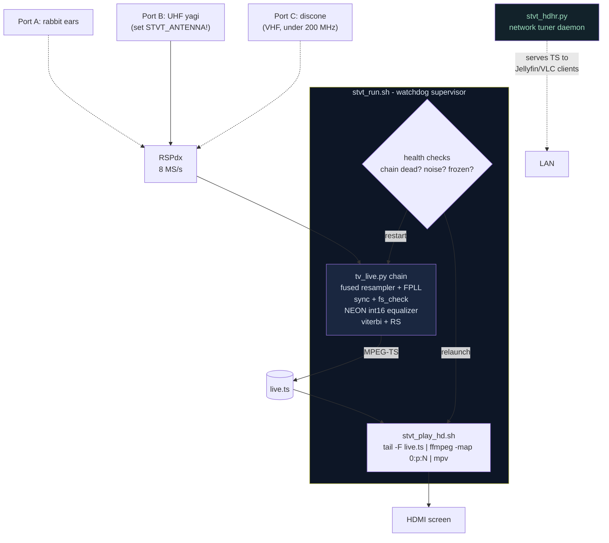
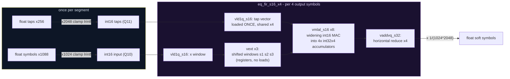

# STVT on the Raspberry Pi 5 — Architecture & the NEON Kernels

How a $80 computer decodes live ATSC television in software, and the custom
SIMD kernels that make it fit.

## The Pi pipeline

`tools/stvt_run.sh <rf> <prog>` is the one command. It supervises everything:



Operational laws learned the hard way:

- **Export `STVT_ANTENNA` (and gains) before launching** — the baked defaults
  reflect whatever antenna layout existed when the script was last tuned. A
  chain "decoding" the wrong port reads `in_rms ≈ 2` (static) and produces
  nothing, cheaply — which can masquerade as a healthy low-CPU run.
- **Never hard-kill the chain** (`kill -9`/TERM storms wedge the SDRplay API
  service until a physical USB replug). SIGINT only; restart the service
  after any kill; verify with an actual open-and-stream test, not just
  enumeration.
- **One supervisor at a time** — two `stvt_run` instances fight over the
  device and the player, each adopting/restarting the other's children.
- The stall mode on a Pi is **pipeline lockstep, not compute**: with no
  thread saturated the chain can still miss real time. The fix is
  `STVT_MIN_BUF_BYTES=8388608` (per-edge byte-scaled GNU Radio buffers),
  plus the player stack at `nice +10`.

## The NEON int16 equalizer kernel (`STVT_EQ_S16=1`)

The 256-tap adaptive equalizer is the chain's hottest block: 832 symbols ×
256 taps ≈ 213k MACs per segment, ~21.5 M MAC/s sustained, every segment,
forever. On x86, VOLK's AVX float dot products absorb this. On ARM, the
generic path left the Pi at a fraction of real time — so the filter got its
own hand-written kernel.

### How we made our own kernel

1. **Fixed-point analysis first.** 8-VSB symbols live at ±7 with bounded
   excursions, taps are leakage-bounded near ±1. Quantize input to **Q10**
   (×1024, headroom to ±31) and taps to **Q11** (×2048, headroom to ±15):
   worst-case 64 products per accumulator lane stays under 2³¹ for any state
   the equalizer's divergence bail permits — int32 accumulation provably
   never overflows.
2. **Adaptation stays float.** Only the *filter* (the hot 99%) is int16; the
   LMS updates on field syncs keep full float precision, so convergence
   behavior is untouched. Decode output is bit-comparable in practice
   (segs_aligned identical in A/B).
3. **Amortized quantization.** Taps are re-quantized once per 832-symbol
   segment (~0.1% of the MAC work) — cheaper than tracking dirtiness across
   every tap-writing path (adapt, leak, LKG restore, reseed, DD).
4. **Register blocking, 4 outputs per pass.** The classic FIR trick: load a
   tap vector once, compute 4 neighboring output symbols against it. The
   three shifted input windows are formed **in registers** with `vext`
   (extract) instead of three more memory loads.
5. **Widening MACs.** `vmlal_s16` multiplies 4×int16 pairs and accumulates
   into int32 lanes in one instruction — 8 MACs per instruction pair, no
   intermediate rounding.



**Result: 9.1 → 21.7 Msamp/s on the kernel bench (2.4×)** — the difference
between the equalizer dominating a core and fitting comfortably alongside
the Viterbi.

### Dispatch order (ARM)

```
filterN():  S16 NEON (if STVT_EQ_S16=1, ARM)   <- wins on ARM
            FFT overlap-save (if STVT_EQ_FFT=1) <- wins on wide x86
            VOLK per-symbol dot products        <- portable fallback
```

When both S16 and FFT are enabled on ARM, S16 is checked first: the 2048-pt
FFT's working set pressures the Pi's cache more than the blocked int16
stream does.

*(All measurements: Raspberry Pi 5, Cortex-A76 ×4 @ 2.4 GHz, 4K-page
kernel, profiled VOLK. The kernel lives in
`gr-atscplus/lib/atsc_equalizer_long_impl.cc` behind `__ARM_NEON`.)*
