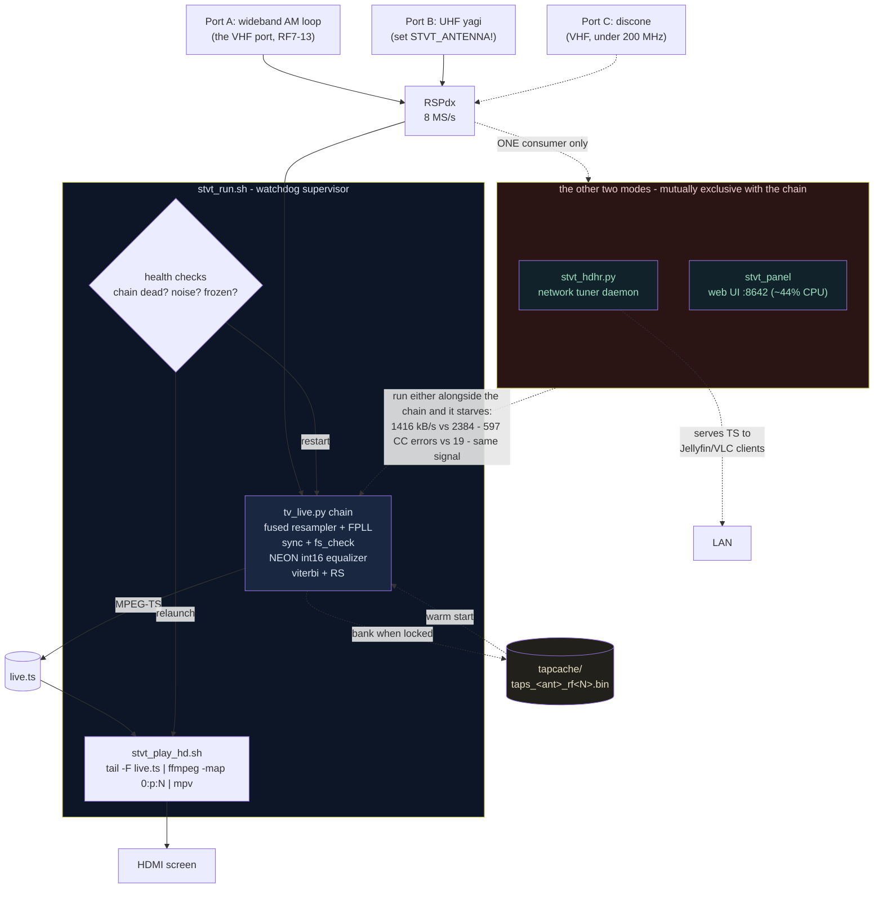
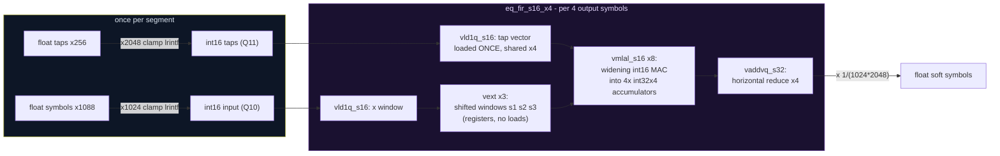

# STVT on the Raspberry Pi 5 — Architecture & the NEON Kernels

How a $80 computer decodes live ATSC television in software, and the custom
SIMD kernels that make it fit.

## The Pi pipeline

`tools/stvt_run.sh <rf> <prog>` is the one command. It supervises everything:



Operational laws learned the hard way:

- **Export `STVT_ANTENNA` before launching.** You no longer have to pick the
  gains: `stvt_run.sh` carries a per-antenna, per-band gain profile, because
  one hardcoded pair cannot serve two different antennas. Measured 2026-07-31:
  the loop on VHF RF9 at the old yagi hardcode (IFGR=40, rfgain_sel=3) railed
  the front end — `in_rms` 1148, `max|x|` 1.5707, 100% TEI, zero bytes
  decoded — while IFGR=45 / rfgain_sel=4 on the same port and channel gave 36
  real PIDs at 14 CC errors/s. A channel that read as stone dead was one gain
  setting away. An explicit `STVT_IFGR` / `STVT_RFGAIN_SEL` still wins.
- A chain "decoding" the wrong port reads `in_rms ≈ 2` (static) and produces
  nothing, cheaply — which can masquerade as a healthy low-CPU run. The
  mirror-image failure is a **railed** front end: `max|x|` pinned at 1.5707
  with a large `in_rms` is too much gain, not a strong station.
- **`stvt_run.sh` warm-starts the equalizer.** It points `STVT_EQ_TAP_CACHE`
  at `tools/data/tv_live/tapcache`, and `tv_live.py` keys the file by antenna
  AND channel (`taps_<antenna>_rf<N>.bin`). A warm tune opens at its plateau
  error instead of converging to it; measured on RF36, CC errors in the first
  60 s fell from 84/42/268 (cold, n=3) to 9/28/0 (warm, n=3). Caveat: the
  cache is gated on the equalizer's own LMS error (`STVT_EQ_LKG_RMS`, default
  1.5), which is ABOVE the ~1.05-1.19 that a non-locking channel sits at — so
  a channel that never decoded can still bank taps. Delete the file if a
  channel starts behaving oddly; a missing or bad cache just falls back to a
  cold start.
- **Never hard-kill the chain** (`kill -9`/TERM storms wedge the SDRplay API
  service until a physical USB replug). SIGINT only; restart the service
  after any kill; verify with an actual open-and-stream test, not just
  enumeration.
- **One supervisor at a time** — two `stvt_run` instances fight over the
  device and the player, each adopting/restarting the other's children.
- The stall mode on a Pi is **pipeline lockstep, not compute**: with no
  thread saturated the chain can still miss real time. The fix is
  `STVT_MIN_BUF_BYTES=8388608` (per-edge byte-scaled GNU Radio buffers),
  plus the player stack at `nice +10`.

## What actually differs from the x86 / radioconda build

Same decoder, same DSP, same `.py` files. The Pi differs in five places, and
every one of them was forced by a measurement rather than chosen:

| | x86 (radioconda) | Pi 5 (aarch64) |
|---|---|---|
| **Equalizer inner loop** | VOLK AVX float dot products | **hand-written NEON int16 kernel** (`STVT_EQ_S16=1`). The generic path left the Pi at a fraction of real time. |
| **Inter-block buffers** | GNU Radio defaults are fine | `STVT_MIN_BUF_BYTES=8388608`. The Pi's stall mode is **pipeline lockstep, not compute** — no thread saturated and still missing real time. |
| **FPLL fold** | on by default (−42% CPU on Threadripper) | on — and it *does* help here, but only once S16 + the bigger buffers are in. An earlier note calling the fold x86-only was wrong. |
| **Player** | full resolution, no interaction | **half-res MPEG-2** (`lowres=1`). A full-res player starves the chain through **memory bandwidth**, not CPU — renice does not fix it, halving the decode does. Pi 5 has no hardware MPEG-2 decode. |
| **SDR self-heal** | `Restart-Service SDRplayAPIService` | `systemctl restart sdrplay`, which needs a sudoers rule no installer creates. See `tools/doctor.py`. |

And one difference that is not about ARM at all but bites hardest: **four
cores and one radio** mean the panel, the network tuner and a direct chain
cannot coexist. See the section above.

Everything else — the decode maths, the equalizer's behaviour, the telemetry
contract — is identical by design. A capture recorded on either machine
replays bit-for-bit comparably on the other, frame counts within the usual
±3 wobble.


## One radio, one consumer — the rule that costs the most to learn

The Pi has **one SDR and four cores**. Three pieces of this project all want
that radio, and only one may have it at a time:

| mode | what runs | what must be off |
|---|---|---|
| **TV on the Pi's own screen** | `tools/stvt_run.sh <rf> <prog>` | `stvt-panel`, `stvt-hdhr` |
| **Network tuner** (watch from another device) | `stvt-hdhr` | the direct chain |
| **Web panel** (tune from a browser) | `stvt-panel` | the direct chain |

Running two is not "a bit slower". Measured on the same channel, same signal,
same code, with only the web panel added alongside a direct chain:

| | panel stopped | panel running |
|---|---|---|
| transport | **2384 kB/s** (real time = 2420) | 1416 kB/s |
| distinct PIDs | 38 | 1208 |
| CC errors | 19 | 597 |
| CPU idle | healthy | 0% |

The panel alone costs ~44% of a core, and `stvt-hdhr` is a *standing* SDR
consumer. Together they starve the chain until it drops samples, which
presents as terrible reception from a perfectly good antenna. An overnight
run in this state played for 1 h 13 m, then hit a 30-restart storm and froze
on its last frame.

**"Stopped" is not enough — check "enabled".** A service that is merely
stopped comes back at the next boot and recreates the conflict, which is the
nastiest version of this bug: it works all day, then breaks after a power
blip. Pick your mode and disable the others:

```bash
# TV on this screen (disable the two that would fight it)
systemctl --user disable --now stvt-panel stvt-hdhr

# ...or the network tuner instead
systemctl --user disable --now stvt-panel
systemctl --user enable  --now stvt-hdhr
```

There is also a **system**-level stowaway worth checking once:
`soapyremote-server` will spin at ~128% CPU in an error loop if it cannot get
the radio, and it is enabled by default on some images —
`sudo systemctl disable --now soapyremote-server`.

`python3 tools/doctor.py` checks all of this for you and prints the exact fix.
Run it first whenever reception looks bad; the answer is more often a rival
process than an antenna.

**Fastest health tell:** distinct PIDs in the transport. Roughly 20–40 is a
healthy mux; hundreds means the chain is dropping samples and the demuxer is
inventing PIDs out of corrupted headers. Judge by transport rate and CC
errors, never by MER alone — MER samples *between* overflows and reads
healthy straight through heavy frame loss.


## The NEON int16 equalizer kernel (`STVT_EQ_S16=1`)

The 256-tap adaptive equalizer is the chain's hottest block: 832 symbols ×
256 taps ≈ 213k MACs per segment, ~21.5 M MAC/s sustained, every segment,
forever. On x86, VOLK's AVX float dot products absorb this. On ARM, the
generic path left the Pi at a fraction of real time — so the filter got its
own hand-written kernel.

### How we made our own kernel

1. **Fixed-point analysis first.** 8-VSB symbols live at ±7 with bounded
   excursions, taps are leakage-bounded near ±1. Quantize input to **Q10**
   (×1024, headroom to ±31) and taps to **Q11** (×2048, headroom to ±15):
   worst-case 64 products per accumulator lane stays under 2³¹ for any state
   the equalizer's divergence bail permits — int32 accumulation provably
   never overflows.
2. **Adaptation stays float.** Only the *filter* (the hot 99%) is int16; the
   LMS updates on field syncs keep full float precision, so convergence
   behavior is untouched. Decode output is bit-comparable in practice
   (segs_aligned identical in A/B).
3. **Amortized quantization.** Taps are re-quantized once per 832-symbol
   segment (~0.1% of the MAC work) — cheaper than tracking dirtiness across
   every tap-writing path (adapt, leak, LKG restore, reseed, DD).
4. **Register blocking, 4 outputs per pass.** The classic FIR trick: load a
   tap vector once, compute 4 neighboring output symbols against it. The
   three shifted input windows are formed **in registers** with `vext`
   (extract) instead of three more memory loads.
5. **Widening MACs.** `vmlal_s16` multiplies 4×int16 pairs and accumulates
   into int32 lanes in one instruction — 8 MACs per instruction pair, no
   intermediate rounding.



**Result: 9.1 → 21.7 Msamp/s on the kernel bench (2.4×)** — the difference
between the equalizer dominating a core and fitting comfortably alongside
the Viterbi.

### Dispatch order (ARM)

```
filterN():  S16 NEON (if STVT_EQ_S16=1, ARM)   <- wins on ARM
            FFT overlap-save (if STVT_EQ_FFT=1) <- wins on wide x86
            VOLK per-symbol dot products        <- portable fallback
```

When both S16 and FFT are enabled on ARM, S16 is checked first: the 2048-pt
FFT's working set pressures the Pi's cache more than the blocked int16
stream does.

*(All measurements: Raspberry Pi 5, Cortex-A76 ×4 @ 2.4 GHz, 4K-page
kernel, profiled VOLK. The kernel lives in
`gr-atscplus/lib/atsc_equalizer_long_impl.cc` behind `__ARM_NEON`.)*
