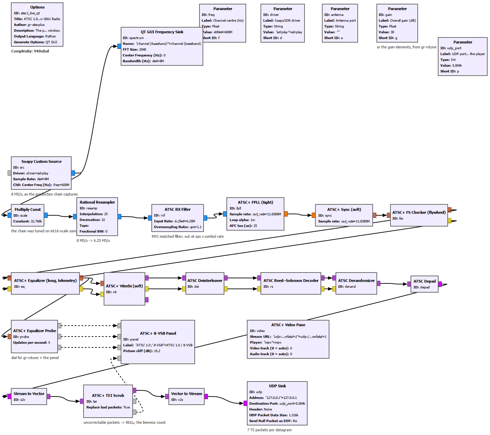

# gr-atscplus in GNU Radio Companion

The STVT receiver has always been a GNU Radio flowgraph - `tools/tv_live.py` builds it in
Python - but it never had a `.grc` file, a window, or GRC definitions for most of its blocks.
Now it does. The flowgraphs here are the **production chain, block for block**, with the
STVT_* defaults the day-to-day tools use (`adaptive-tv/chain_lab.py` BASE_ENV):

```
 8 MS/s ─► x25/32 ─► RRC matched filter (1.1 sps) ─► ATSC+ FPLL (tight; DC block + AGC folded in)
        ─► ATSC+ Sync (soft) ─► ATSC+ FS Checker ─► ATSC+ Equalizer (long) ─► ATSC+ Viterbi (soft)
        ─► Deinterleaver ─► Reed-Solomon ─► Derandomizer ─► Depad ─► ATSC+ TEI Scrub ─► transport stream
                                                  │
                                                  └─► ATSC+ Equalizer Probe: MER dial, eye, echoes
```

| flowgraph | what it is |
|---|---|
| `atsc1_replay.grc` | headless: an 8 MS/s cf32 capture in, transport stream out. The byte-for-byte check against `tools/tv_replay.py`. |
| `atsc1_live_qt.grc` | a SoapySDR radio in; spectrum, the **8-VSB panel** (eye, echoes, MER, packet health) and **the picture in the window** (mpv drawing into a pane, fed over local UDP). |



`make_grc.py` writes both from one description, so they cannot drift. Nothing about any
station is in them: channel, antenna port and gain are flowgraph Parameters.

## Tested (2026-09-21, RSPdx, an indoor antenna, one UHF channel)

- **Byte for byte against the production tool.** 30 s of 8 MS/s air through `tools/tv_replay.py` and
  through `atsc1_replay.grc`, same STVT_* environment: 386,532 transport packets each, **386,309
  identical**. The 223 that differ are exactly the RS-uncorrectable ones, and they differ only in how
  each tool's TEI scrub writes the NULL packet (`tv_replay.py` keeps the payload and continuity
  counter; `tv_live.py` - what this block ports - writes a canonical all-0xFF NULL). The DSP is identical.
- **Live, in the window:** `atsc1_live_qt.grc`, 75 s: MER 18.8-19.0 dB, 959,866 packets, 1,263
  uncorrectable (99.87 % clean), picture and sound in the pane from the first seconds.
- **With gr-rxtune in the loop, live** (`gr-rxtune/examples/atsc1_native_live.grc`): HEALTHY verdict
  in 142 s over 21 gain cells, MER 18.9 dB, reproduced four times; the equalizer re-converges within a
  second of each gain change (visible in the MER trace). An independent decoder on the UDP stream
  counted **240 of 240 video frames in every 8 s window** sampled through the search - the picture
  never stops while the loop tunes. (The ATSC 3.0 loop, which must capture per cell, takes ~640 s.)

Two things that fooled the tests, so you are not fooled: a Qt widget grab (`widget.grab()`) cannot
see a native video surface and shows the pane black - take a screen-region grab; and the UDP stream
is unicast, so a second listener on the port (a probe) sees nothing while the player holds it.

## New blocks

Four pure-Python blocks (no compiler needed) and GRC definitions for the compiled blocks the
chain uses that had none (`FPLL (tight)`, `Sync (soft)`, `Viterbi (soft)`, `Noise Blanker`):

| block | what it does |
|---|---|
| **TEI Scrub** | the `TEIScrub` class from `tv_live.py`, as a block: uncorrectable packets -> NULL packets, counted. Its `liveness` message is a count a dead chain cannot fake. |
| **Equalizer Probe** | taps the equalizer's output: `dial` = decision-directed MER (dB), `symbols` for an eye display, `taps` = the equalizer's taps (the echoes). Costs almost nothing. |
| **8-VSB Panel** (Qt) | eye against the eight levels, |taps| in dB, MER trace with the ~15 dB picture cliff marked, packet totals. |
| **Video Pane** (Qt) | hosts mpv inside the window on the UDP transport stream; respawns it, bounded. |

## Run from the source tree (nothing installed)

```
set GRC_BLOCKS_PATH=<this tree>\grc
python examples/make_grc.py
grcc -o build/grc examples/atsc1_replay.grc examples/atsc1_live_qt.grc
python examples/run_grc.py build/grc/atsc1_replay.py -- -c capture.cf32 -o out.ts
python examples/run_grc.py build/grc/atsc1_live_qt.py --seconds 60 --png shot.png -- -f <Hz> -a "<port>" -g 30
```

`examples/_devpath.py` grafts the Python blocks onto the installed `gnuradio.atscplus`;
`run_grc.py` honours a site radio lock (RXTUNE_LOCK, see gr-rxtune) and can pass gain
elements with `--call "src.set_gain(0,'IFGR',46)"`. QA: `python python/atscplus/qa_python_blocks.py`.

## With gr-rxtune

gr-rxtune's `examples/atsc1_native_live.grc` puts its controller **in the loop on this chain,
live**: the Equalizer Probe's MER is the dial, the TEI Scrub's clean-packet count is the
liveness, gains go to the Soapy source by message, and the picture keeps playing through every
gain change. That is the attachment mode a receiver made of GNU Radio blocks makes possible.

## Notes

- `STVT_FPLL_FOLD=1` (DC blocker + AGC inside the FPLL: -42 % CPU, bit-identical) is a
  process-wide switch the block has no parameter for; the flowgraphs set it with an Import block.
- The chain was tuned on int16-scale samples: the x32768 after the source is part of the chain.
- Decision-directed MER is exact while the eye is open and reads HIGH as it closes (wrong
  decisions look like small errors): treat it as a dial above ~15 dB and a floor below. The
  field-sync MER in the equalizer's `STVT_EQ_TELEM=1` line is the unbiased one.
